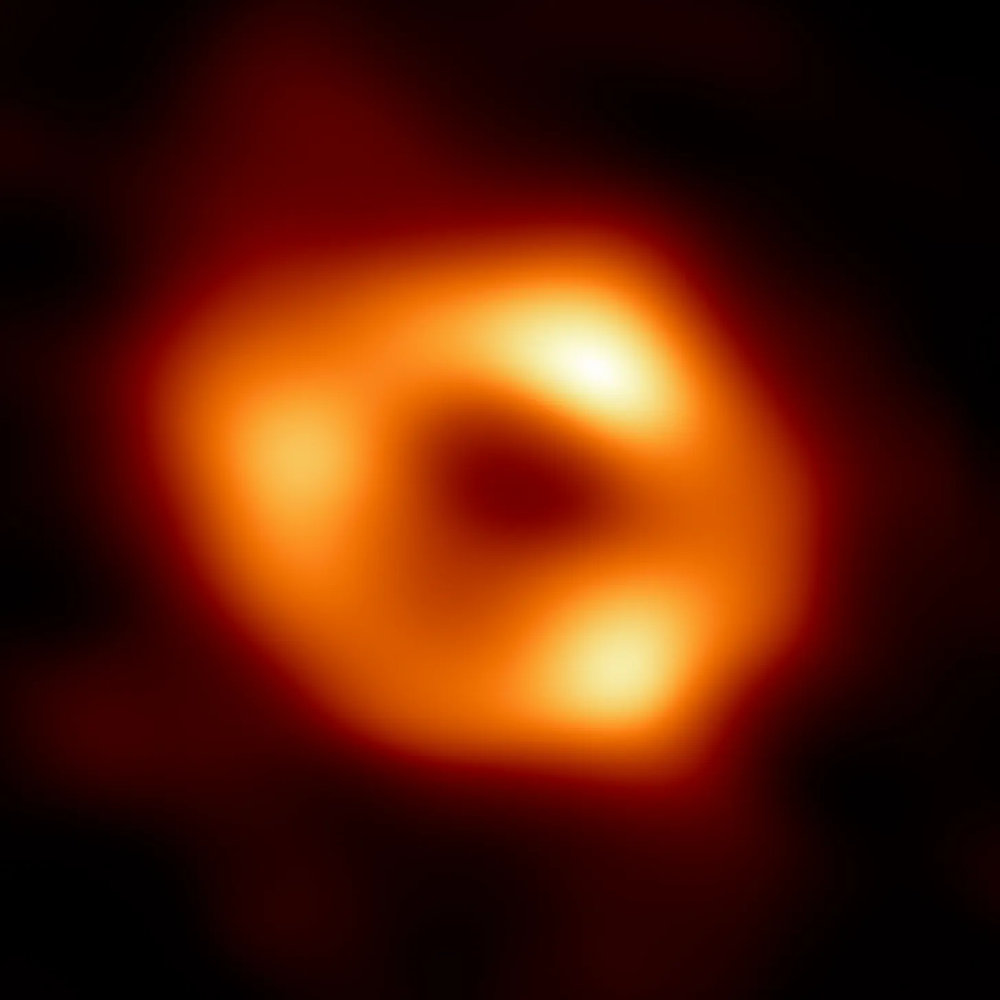
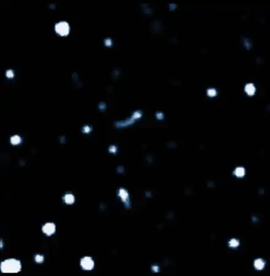
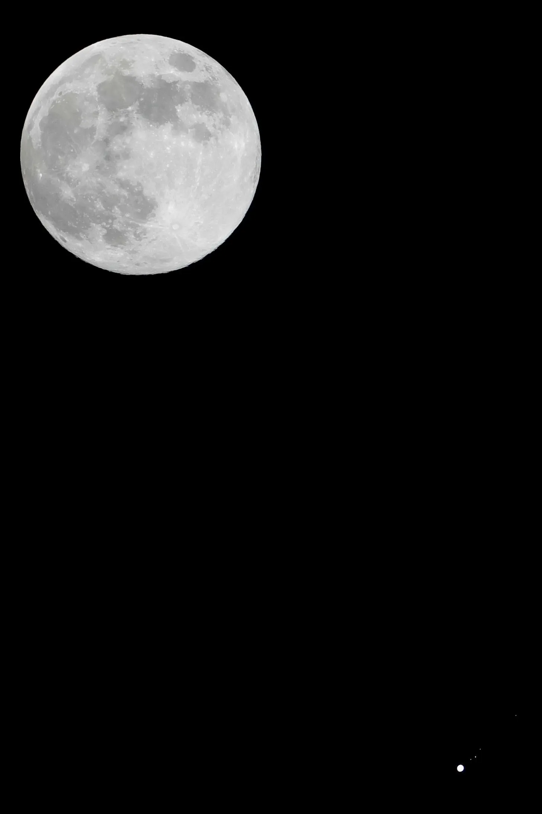
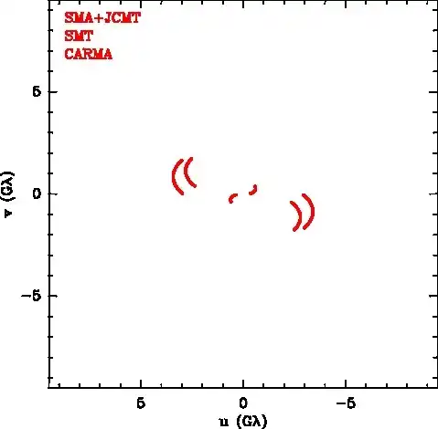

_Originally posted on Substack by the author_

_Sagittarius A\*: The blackhole in the centre of our own galaxy, Milkyway ([Link](https://eventhorizontelescope.org/blog/astronomers-reveal-first-image-black-hole-heart-our-galaxy))_

If you haven't seen this image, but reached this post, written by me… First of all, thanks for the honour. Secondly, this image symbolizes numerous achievements of the human civilization.

Of course, you must have seen this image before now. However, most people I talked to about this seems to underestimate the magnitude of the success of the Event horizon Telescope team ([EHT team](https://eventhorizontelescope.org/)). The image itself is a data visualization, created using a plethora of data collected by the EHT collaboration. It is fascinating how such an incredible accomplishment is being shared using a photograph.

Let me walk you through a whole lot that is behind this image, and how we got here. I will just summarize the sections, because they can each be a book by themselves, and I am no expert on physics.

## Knowing that the blackholes exist

It can be considered common knowledge that Einstein's Theory of Relativity hypothesized blackholes. However to reach Einstein, science had to go through Newton. In classical Newtonian physics, we couldn't estimate a blackhole. Space-time were thought to be two separate entities. But Newton's equations helped us get to the point of verifying theories with observations, and improving them. Scientists were forced to look for a new theory because Mercury's orbit was too close and fast for it to be stable as per classical equations.

Blackholes are a possibility in Einstien's General Theory of Relativity. However, not every mathematical solution is a physical one, for example, it is mathematically totally possible a magnetic monopole to exist, but it hasn't been found in our physical world. Considering this, Einstien himself never believed in the existence of Blackholes.[[1](https://www.jstor.org/stable/1968902?seq=1#page_scan_tab_contents)] Later, we could see their effects once the telescopes got powerful enough.

How do we know what we see in the image is a blackhole?

It has been suspected since the 1980s that there might be a blackhole at the galactic centre. However, it wasn't until 2008 that all the doubts were cleared.[[2](https://www.universetoday.com/22104/beyond-any-reasonable-doubt-a-supermassive-black-hole-lives-in-centre-of-our-galaxy/)] The left image below shows a composite video of the galactic centre captured over 26 years.[[3](https://www.eso.org/public/news/eso1825/)] And the right one, depicting estimated orbits of stars around the blackhole[[4](https://arxiv.org/abs/astro-ph/0502129)], is a more obvious data visualization.

_Timelapse of stars orbiting incredibly fast around a seemingly blank space_

It is worth bringing the attention to the fact that blackholes are a perfect black. They reflect/create no signals, and one can think of them as regions of space rather than objects in space. We can never see a blackhole using light (the whole electromagnetic spectrum is totally absorbed by the blackholes).

One of the stars was observed to be going 24 million meters per second, that's 8% the speed of light. The only thing that could keep a star in orbit at the distance observed could be a blackhole. So, in a way, we fallback to the process of elimination from all the objects that can cause this effect. Additionally, the observations show us nothing observable at the orbital centre. This would all have been surprising (and causing more 'physics broke!' youtube videos) if we didn't have any theory to back it up. But we did, and the observations matched up.

At that point, it was confirmed that a blackhole existed at the galactic center, and we can observe it on a particular point in sky. Pointing our telescopes to that point, should yield us a "picture" of a blackhole.

## But wait, what to observe?

The next challenge was to understand what to observe. It is well understood that different objects in the universe emit different part(s) of the electromagnetic spectrum. The Hubble Telescope, for instance, can only observe the visible light spectrum. The James-Webb Telescope is built to observe the infrared spectrum. So the question is what part of the full spectrum should we try to observe?

When waves escape the gravity of a blackhole, their wavelengths they are elongated. In other words, their wavelengths become longer. Additionally to observe a wave, we need to have a sensor that is at least that length. Fun fact: That is why an FM radio antenna is a long one. About a decade ago, phones could use the wire of plugged-in head/earphones as an FM radio receiver. But, I digress.

Radio waves are the longest wavelength that we can observe. Hence, we needed a radio telescope. That is not to say that there are no wavelength longer than radio (so called long waves)… there most definitely are, but we don't have the technology to observe them. So, let's point our radio telescope to a blackhole and see it.

## Not quite yet

Stars (or any other celestial objects) are effectively point sized objects in our night skies, except the sun and the moon ofcourse. A telescope zooms-in by a lot, A LOT, to be able to observe them. The aperture of the telescope, meaning the size of the primary mirror, defines how small of a section of sky can it observe. In other words, it decides the resolution of a telescope.

By the time all of the above, plus more, was figured out. Numerous blackholes were located in the universe. Another big question that was posed was: Which blackhole to look at (photograph)? The largest blackhole known is not the "largest-visible" from our planet.

## Apparent size

_Moon and Jupiter with it's moons — By Bautsch ([link](https://commons.wikimedia.org/w/index.php?curid=57904264))_

Everything in our skies has an absolute size and an apparent size. For instance, the moon in the above picture has a large apparent size as compared to Jupiter in the bottom-right corner of the image. While Jupiter's absolute size is bigger. Consequently, it is easier to photograph the moon than Jupiter.

The blackhole with the largest apparent size is what we should be looking at to photograph. It just so happens, that there are 2 blackholes with similar apparent size that are also visibly the largest. M87 which is 1,000 times bigger than Sagittarius A* but almost as far. Sagittarius A* is the blackhole in the center of our galaxy 26,000 light year away, while M87 is 535,000,000 light years away. Both of the blackholes have a similar apparent size.[[5](https://repository.ubn.ru.nl/bitstream/handle/2066/202545/202545.pdf;jsessionid=447A0675CD41ABEC9DCABBB60C8B52D6?sequence=1), [6](https://www.aanda.org/articles/aa/full_html/2019/05/aa35656-19/aa35656-19.html)]

## Size of the telescope

To make observations of the apparent size of any of these black holes, the size of the telescope we need is huge. This is determined by a formula for its resolving power. Resolving power is directly propotional to the wavelength (which is not in our control), and inversely propotional to the diameter of the telescope.

So, larger the telescope, the smaller objects it can observe. Unfortunately, to observe the apparent sizes of the blackhole(s) we need a telescope the size of the Earth, which is impossible to build. (at least for now) So EHT fallbacks to the next best thing, using the radio telescopes all around the Earth to mimic a telescope as large as the Earth. EHT uses the rotation of the planet to get more data points within this virtual planet-sized telescope.

_Technology of Event Horizon Telescope ([read more](https://eventhorizontelescope.org/technology))_

## Other challenges

Initially, the EHT team decided to photograph Sagittarius A* first. Soon realizing that M87 should be attempted before Sagittarius A*. There were 2 major reasons. First, the line of sight from our planet to the galactic center has a lot of objects and gas clouds interupting our vision. Second, the smaller size of Sagittarius A\* makes something moving at high speeds orbit it faster causing too many changes (imagine a long exposure photograph) in a short period of time. M87 is large so something moving at the light speed also takes longer to complete an orbit. This leads to more consistent overtime observations for M87.

Veritasium explains is better on Youtube.([video link](https://youtu.be/Q1bSDnuIPbo))

## Photographing with Machine Learning

It might be surprising that it would have been impossible to photograph any blackhole without so many inventions coming together. To name a few in a short list:

- Kepler: Laws of planetary motions (1609–1619)
- Newton: Classical gravitational mechanics (1680s)
- [Newcomb & Hall](https://adsabs.harvard.edu/pdf/1894AJ.....14...49H): Orbital observations of Mercury (1894)
- Einstein: Theory of relativity (1905–1915)
- [Schwarzschild](https://arxiv.org/abs/physics/9905030): Solution of relativity predicting blackholes (1916)
- [Eddington & Crommelin](https://www.science.org/doi/pdf/10.1126/science.50.1301.518): Total solar eclipse experiment to test relativity
- Telescope technologies since Galileo
- Electromagnetic wave equations and spectrum understanding since Maxwell
- Computers, simulation technologies and artificial intelligence

To create a whole image with the limited number of pixels available is a computational problem. But to do that we need to train our machines on numerous number of images and improve our image quality. This is the same technology used in our cellphones these days. All phones have a trained AI model to generate images from the small sensor (little data) and improve the quality of what the sensor observed.

That being said, there are other clever techniques like [radio interferometry](https://public.nrao.edu/interferometry-explained/) and computer simulations from the theory of relativity that contribute to the level of computational photography that the EHT team has used to create the images of these blackholes.

## Why does it matter?

With all of the achievement and its celebration, the underlying question however is why does it even matter? Humans have always wondered about their place in the universe, and how, why do we even exist? Our religions are most likely an effort to explain our existence. We like to add meaning to our lives, and we are always on the search. The direct blackhole observation is moving further along that train of thought.

We do science, to understand ourselves. It eventually leads to improving our lives, for instance, understanding electricity and magnetic fields have put microwaves in our homes. We have built cars, satellites, unfathomable infrastructures like the grid, under-ocean cable network and so on… Science works!

By understanding and observing our universe, we take steps, however little they may be, to improve our understanding and add value to our lives.

Thanks for reading!
